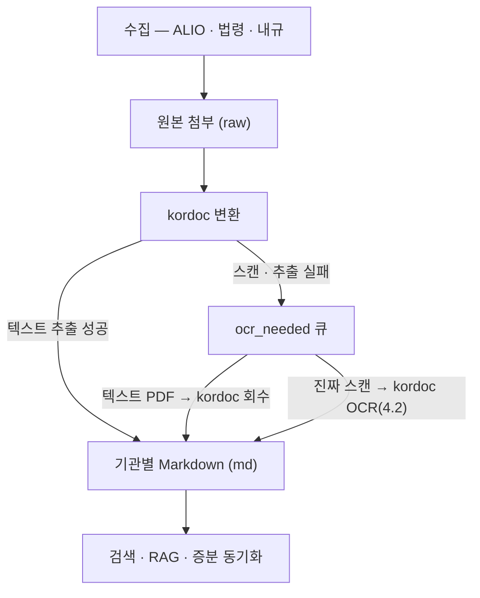

<div align="center">

# crawl4alio

**공공기관 경영정보(ALIO)·국가법령·기관 내부규정을 수집하고 첨부문서를 Markdown으로 변환하는 Node.js 파이프라인**

[](LICENSE)
[](https://nodejs.org)


[기능](#-기능) · [아키텍처](#-아키텍처) · [설치](#-설치) · [빠른 시작](#-빠른-시작) · [사용법](#-사용법) · [설정](#-설정) · [운영 교훈](#-대규모-운영에서-배운-것)

</div>

---

[ALIO](https://www.alio.go.kr)(공공기관 경영정보 공개시스템)의 355개 기관 × 92개 공시항목, [law.go.kr](https://www.law.go.kr) 법령·행정규칙, 기관 내부규정을 수집하고, 첨부파일(HWP·PDF·XLSX·DOCX)을 검색·분석 가능한 Markdown으로 변환합니다. 수만 건의 report와 수십만 첨부를 실제로 운영하며 다듬은 체크포인트·증분·병렬화가 들어 있습니다.

> ⚠️ **이 저장소는 수집·변환 방법론(코드)만 배포합니다.** 수집된 실제 데이터(공시 첨부·법령 원문·기관 내규)는 포함하지 않습니다. 각자 환경에서 직접 수집하세요. 기수집본 문의는 [아래](#기수집-데이터-문의) 참고.

## 📋 목차

- [기능](#-기능)
- [아키텍처](#-아키텍처)
- [설치](#-설치)
- [빠른 시작](#-빠른-시작)
- [사용법](#-사용법)
- [설정](#-설정)
- [프로젝트 구조](#-프로젝트-구조)
- [대규모 운영에서 배운 것](#-대규모-운영에서-배운-것)
- [문서](#-문서)
- [기여](#-기여)
- [라이선스](#-라이선스)

## ✨ 기능

- **ALIO 경영공시 수집** — 355개 기관 × 92개 공시항목(정기/수시 자동 구분). 항목(`--scope`/`--categories`/`--items`)·기관(`--ministry`/`--apba-ids`/`--inst-type`)을 자유 선택. 본문 없는 문서첨부형은 `--attach-only-items`로 크롤러를 건너뛰어 대폭 가속.
- **게시판형 공시 수집** — 일반 다운로더가 스킵하는 게시판형(disclosureNo 없음) 전담: 국회 지적(B1210)·감사원 지적(B1220)은 본문+첨부, 경영평가결과(B1230/B1250)는 첨부, 채용공고(B1010/B1020)는 게시글+첨부 전량(posting 체크포인트·병렬).
- **증분 동기화** — 저장본과 웹 최신본을 대조해 신규·누락만 수집(`sync_alio.js`/`sync_legal.js`). report 체크포인트로 **원본(raw)을 오프사이트로 옮겨 삭제한 뒤에도** 증분 가능.
- **법령·행정규칙 수집** — law.go.kr Open API(DRF)로 본문+별표·서식 구조화 수집, 검색 기반 추가, ALIO 법령/지침 게시판(기재부 지침 개정 이력) 수집.
- **기관 내부규정 수집** — ALIO 게시판에서 최신본 또는 개정 이력 전체(`--all-files`).
- **Markdown 변환 파이프라인** — HWP/PDF/XLSX/DOCX를 **kordoc**으로 변환. 스캔본 OCR도 **kordoc 4.2**(기본)이며 markitdown·PaddleOCR은 선택/legacy 폴백. ZIP 자동 해제, 스캔 PDF 품질 게이트, raw/md 트리 분리 출력.
- **OCR 큐 회수 (kordoc 우선 원칙)** — OCR 큐에 잘못 들어간 텍스트 PDF를 kordoc으로 되찾아옵니다. OCR보다 15~45배 빠르고 깨끗한데다, 회수가 도는 동안 OCR이 같은 문서를 먼저 잡아가는 경쟁까지 `kordoc_pending` 목록으로 차단합니다. 이미 OCR로 처리해버린 문서도 `--reprocess`로 kordoc 결과로 교체 가능.
- **OCR 스케일아웃** — 밴드(크기·밀도)·페이지 균형점·인스턴스별 체크포인트 env로 **약한 CPU 여러 대에 스캔 문서 OCR을 분산**. 메모리 안전(고해상도→고RAM PC)과 속도 균형(느린 PC 과부하 방지)을 함께 잡고, 클라이언트 fail-fast + 서버 자가종료로 **OOM/hang 무인 자기치유**.
- **OCR 후처리 (조문 구조 정리)** — OCR이 훼손한 조문 경계·순번 표식을 감사→dry-run→적용→재감사 사이클로 보수 복원. 원문 의미는 절대 추정하지 않고, 실패 사례(과다 승격 945건 복구)에서 배운 규칙이 코드에 박혀 있습니다 ([docs/POSTPROCESS.md](docs/POSTPROCESS.md)).
- **RAG 확장 모듈 (`rag/`)** — md 코퍼스를 조(條) 단위로 PostgreSQL(pg_trgm+pgvector)에 적재하고 키워드·의미·RRF 하이브리드 검색 제공. HTTP API·MCP 서버·감사컬럼·2단계 filtered semantic 포함 — 136만 조문 실운영 스택 그대로 ([rag/README.md](rag/README.md)).
- **무인 운영 스크립트** — 워치독(사망·정체 재기동), 밴드 동적 재배분(빈 PC에 일감 이관), 회수→재처리 체인이 `scripts/`에 동봉. 감독 프로세스까지 포함해 **cron만 걸면 사람 없이 돕니다** ([docs/CONVERSION.md §3-2](docs/CONVERSION.md)).

## 🏗 아키텍처



> 파서 폴백(markitdown)·수집 경로별 상세는 아래 표 참고.

**수집 계층** — 목록(카탈로그) → 크롤러:

| 계층 | 스크립트 | 대상 | 방식 |
|------|----------|------|------|
| ① 목록 | `fetch_disclosure_catalog.js` | 공시항목 92종(정기/수시) | formList API |
| | `data/institutions.json` | 공공기관 355개 | 정적 시드(갱신 수집기 미구현 — 알려진 갭) |
| ② 크롤러형 | `download_documents_advanced.js` | disclosureNo 있는 일반공시 | 상세페이지 Crawl4AI + 첨부 HTTP |
| ③ 게시판형 | `collect_board_disclosures.js` | B1210/B1220(본문+첨부)·B1230/B1250(첨부) | 게시판 API + fileNo |
| | `collect_recruit_attachments.js` | B1010/B1020 채용공고 | 병렬 + posting 체크포인트 |
| | `collect_institution_bylaws.js` | 기관 내부규정 | 게시판 + 최신본/전체 |
| ④ 별도 소스 | `collect_legal_corpus.js` / `sync_legal.js` | 법령·행정규칙 | law.go.kr DRF API |
| | `collect_alio_lawboard.js` | 기재부 지침 개정 이력 | 게시판 JSON |

모든 계층이 `CATALOG_ROOT` 하나로 데이터 루트(목록·수집물·체크포인트·로그)를 공유합니다.

**변환 체인** — `kordoc`(HWP3/5·HWPX·PDF·XLS(X)·DOCX, npm 내장이라 서버 불필요) → `markitdown`(XLS(X)/PPTX 폴백, 선택). 스캔 PDF/이미지 **OCR도 기본 kordoc 4.2**(내장 `KORDOC_OCR` 또는 `--ocr` 서버)이며 PaddleOCR은 legacy 폴백입니다. 스캔 PDF는 kordoc이 빈 텍스트로 "성공" 반환하므로 **페이지당 글자 수 게이트**로 걸러 OCR 큐로 넘깁니다.

원칙은 하나입니다 — **kordoc이 읽을 수 있는 문서는 끝까지 kordoc이 처리한다.** OCR은 진짜 스캔본만 맡습니다. 그래서 OCR 큐로 새어 들어간 텍스트 PDF는 `recover_ocr_text_pdfs.js`가 kordoc으로 되찾아오고(품질 게이트 통과분만), 회수가 판정 중인 문서는 `kordoc_pending` 목록으로 OCR이 건드리지 못하게 막습니다. 순서로 쓰면: **변환 → 회수 → OCR**.

최종 산출물은 기관별 Markdown이며, 원본 첨부(raw)와 변환·메타(md) 트리를 분리해 raw를 오프사이트 보관할 수 있습니다.

- **kordoc** — [github.com/chrisryugj/kordoc](https://github.com/chrisryugj/kordoc), npm 의존성으로 내장.
- **Crawl4AI**(ALIO 본문 표) — 외부 서비스, 풀스택 docker compose 포함. **OCR**은 kordoc 4.2가 기본(내장/서버), **PaddleOCR**은 legacy 폴백(`--profile legacy-ocr`).

## 📦 설치

| | 최소 프로필 | 풀스택 프로필 (권장) |
|---|---|---|
| 요구사항 | Node 18+ | Node 18+ · Docker |
| 설치 | `npm install` | `npm install` + `cd deploy && docker compose up -d` |
| ALIO 첨부·법령·내규·통계·동기화 수집 | ✅ | ✅ |
| HWP/PDF/DOCX/XLS(X) → MD | ✅ (kordoc 내장) | ✅ |
| 스캔 PDF OCR | ✅ kordoc 내장(`KORDOC_OCR=1`) | ✅ kordoc `--ocr` 워커 / PaddleOCR(legacy) |
| ALIO 본문 표 수집 | ❌ 스킵 | ✅ Crawl4AI |

풀스택은 **단일 머신 기준 Intel N100급(4코어/8GB)** 이면 충분합니다. 초기 대량 스캔 PDF OCR은 CPU 특성상 시간이 걸리므로 [OCR 스케일아웃](#-설정)으로 여러 대에 분산할 수 있습니다. 전체 절차(Docker~cron)는 **[docs/INSTALL.md](docs/INSTALL.md)**.

> 🤖 이 저장소를 Claude Code 등 AI 에이전트로 열면 [CLAUDE.md](CLAUDE.md) 가이드로 진단~설치~검증을 도와줍니다.

## 🚀 빠른 시작

```bash
npm install
cp .env.example .env.api      # law.go.kr API 키 등 입력
source .env.api

node collection/check_services.js         # 환경 진단(활성 기능 확인)
cd deploy && docker compose up -d crawl4ai && cd .. # (풀스택) crawl4ai 기동 — OCR은 kordoc 기본

# 1) 수집
node collection/download_documents_advanced.js --print-scope        # 범위 미리보기
node collection/download_documents_advanced.js --categories 노동조합  # 예: 특정 항목
node collection/collect_board_disclosures.js --forms B1210,B1220 --years 3

# 2) 변환 — 순서 중요: 변환 → 회수 → OCR
npm run build:file-index
npm run convert:markdown
node collection/recover_ocr_text_pdfs.js   # OCR 큐로 샌 텍스트PDF를 kordoc으로 회수
npm run convert:ocr

# 3) 증분 운영
npm run sync:alio                              # 신규 감지(리포트)
node collection/sync_alio.js --mode=apply      # 감지 즉시 수집
```

## 🛠 사용법

주요 npm 스크립트 (전체는 `package.json`):

| 명령 | 설명 |
|------|------|
| `npm run collect:alio` | ALIO 경영공시 메인 수집 |
| `npm run collect:legal` / `sync:legal` | 법령·행정규칙 수집 / 개정 동기화 |
| `npm run collect:bylaws` | 기관 내부규정 수집 |
| `npm run collect:recruit` | 채용공고 게시글+첨부 |
| `npm run sync:alio` | 신규·누락 공시 감지 |
| `npm run build:file-index` | manifest → 다운로드 파일 인덱스 |
| `npm run convert:markdown` | 첨부 → Markdown(kordoc/markitdown) |
| `npm run convert:ocr` | 스캔 문서 OCR(기본 kordoc / legacy PaddleOCR) |
| `npm run extract:zips` | ZIP 자동 해제(기본 원본 삭제, `--keep-zip`) |

세부 옵션은 [docs/COLLECTION.md](docs/COLLECTION.md), [docs/CONVERSION.md](docs/CONVERSION.md), [docs/PARSERS.md](docs/PARSERS.md).

## ⚙️ 설정

`.env.example`을 `.env.api`로 복사해 채웁니다. 주요 변수:

| 변수 | 용도 |
|------|------|
| `CRAWL4AI_URL` / `CRAWL4AI_API_TOKEN` | ALIO 상세페이지 크롤링 엔드포인트·토큰 |
| `KORDOC_PARSE_URL` | kordoc HTTP 서버(미설정 시 npm 내장 사용) |
| `KORDOC_OCR` | 내장 kordoc(4.2.0+) 텍스트 OCR 스위치. **기본 off** · `1`/`on`=needsOcr 페이지만 · `force`=전 페이지. OCR 워커 머신에서만 켠다 |
| `MARKITDOWN_PARSE_URL` | markitdown 폴백(선택) |
| `OCR_ENGINE` | OCR 큐 처리 엔진: `kordoc`(기본, 4.2 `--ocr`) / `paddleocr`(legacy 폴백). 메타·체크포인트 parser 표기 |
| `OCR_PARSE_URL` | OCR 워커 /parse 엔드포인트(엔진 무관, 응답 계약 동일). 미설정 시 `PADDLEOCR_PARSE_URL` 폴백 |
| `PADDLEOCR_PARSE_URL` | (하위호환) 외부 PaddleOCR 엔드포인트. `OCR_PARSE_URL` 우선 |
| `OPENAPILAWKEY` / `LAW_OC` | law.go.kr Open API 이용자 ID |
| `CONCURRENT` / `CONCURRENT_LARGE` / `LARGE_FILE_MB` | 동시성·대용량 튜닝 |

### 배포 프로파일 (브랜치 아님 — 같은 코드, env 조합만 다름)

변환·OCR 스택은 **하나의 코드베이스**에서 env로 모드를 고른다. 별도 브랜치를 파지 않는다
— 프로파일은 "어떤 env를 켜느냐"의 문제일 뿐이다. (수집 단계 crawl4ai는 어느 프로파일이든 필요 — 역할이 다르다: crawl4ai=웹 상세페이지 수집, kordoc=내려받은 첨부 변환.)

| 프로파일 | 설정 | 쓰임새 |
|---|---|---|
| **올인원(kordoc 내장)** | env 없음(텍스트) / OCR 워커만 `KORDOC_OCR=1` | 서버 불필요. kordoc npm 하나로 변환+OCR. 소규모·단일 호스트·오프라인 |
| **서버형(HTTP)** | `KORDOC_PARSE_URL`(+OCR은 kordoc `--ocr` 서버)·(선택)`MARKITDOWN_PARSE_URL`·(legacy)`PADDLEOCR_PARSE_URL` | 파서를 별도 컨테이너/서버로. 대규모·언어혼합·기존 인프라 |

**OCR (기본 kordoc — 두 방식 중 택일, PaddleOCR은 legacy 폴백)**:
- **내장** `KORDOC_OCR=1` — kordoc 4.2의 PP-OCRv5(onnxruntime) 로컬 추론. `needsOcr` 페이지만 OCR하고 정상 페이지 텍스트는 유지, 스캔 표를 HTML 표로 복원. 서버·포트 불필요. 첫 실행 시 모델 ~18MB 자동 다운로드(`kordoc check-ocr-models`로 사전 준비) → **오프라인 워커는 모델 캐시 선배포 필요**.
- **kordoc `--ocr` HTTP 서버** — `OCR_ENGINE=kordoc`(기본) + `KORDOC_PARSE_URL`/`OCR_PARSE_URL`. OCR 큐(`convert_ocr_needed`)를 워커로 분산할 때.
- **(legacy) PaddleOCR** — `OCR_ENGINE=paddleocr` + `PADDLEOCR_PARSE_URL`(하위호환).

> ⚠️ **성능**: 내장 OCR은 CPU 추론이라 저사양(예: 셀러론/J1900)에서 **상시·대량은 부적합**. 실측 M-series 0.9s/page 기준. 저사양 호스트는 `KORDOC_OCR`을 끄고(기본) 변환·서빙만 맡기고, OCR은 성능 좋은 워커에 `KORDOC_OCR=1`로 몰아준다. `OCR_SHARD`로 여러 워커에 분산 가능(아래).

**데이터 폴더 분리 (`CATALOG_ROOT`)** — 코드와 데이터를 심링크 없이 분리:

```bash
CATALOG_ROOT=/path/to/data node collection/download_documents_advanced.js ...
# raw/md 분리: 원본=alio-raw, 변환·메타=alio-md
#   자동 해석(structured_data→alio-md) 또는 ALIO_RAW_BASE / --raw-root / --md-root 명시
node collection/seed_download_ckpt.js   # 오프사이트 후 증분용 체크포인트 백필(1회)
```

**OCR 스케일아웃 (여러 CPU에 분산)** — `convert_ocr_needed.js` 환경변수로 스캔 문서 OCR을 여러 대에 나눠 처리. 정적 분할이라 인스턴스 간 겹침·누락 0.

| 변수 | 용도 |
|------|------|
| `OCR_ORDER` | `asc`(소형 먼저) / `desc`(대형 먼저) |
| `OCR_BAND` | 담당 밴드(상보 분할). **`safe`↔`risky` 권장**(메모리+속도 균형, 아래) · `light`/`heavy`(크기) · `small`/`big`(크기+페이지) · 미지정 시 페이지 밴드 |
| `OCR_PAGE_MIN` / `OCR_PAGE_MAX` | (레거시) 페이지 밴드로 담당 구간 제한 |
| `OCR_BAND_SIZE_MAX_MB` | 메모리 안전 경계(기본 0.9). 초과=고해상도 위험 → `risky`(고RAM PC)로 |
| `OCR_BAND_DENSITY_MAX` / `OCR_BAND_MIN_PAGES` | 대용량이라도 **저밀도(MB/page↓)·다페이지**면 저RAM PC가 소청크로 안전 처리(기본 0.5 / 3p) |
| `OCR_SPLIT_PAGES` | **페이지 균형점**. 이 페이지수 이상 문서는 빠른 PC로 강제(느린 PC 과부하 방지) |
| `OCR_CHUNK_PAGES` | 요청당 페이지(저RAM PC는 6~8로 낮춰 요청당 메모리 상한, 기본 50) |
| `OCR_MAX_TIMEOUT` | 요청 타임아웃 상한(ms). 스토리지 스래시 fail-fast |
| `OCR_QUARANTINE_PATH` | OOM 유발 문서 목록(`safe`서 제외/`risky`서 포함) — 자기치유 격리 |
| `OCR_INFLIGHT_PATH` | 처리 중 문서 경로 기록(외부 워치독이 hang 시 격리 대상 식별) |
| `OCR_CKPT_PATH` / `OCR_LOCK_PATH` | 인스턴스별 체크포인트·락 분리 |
| `OCR_SHARD` | **N대 확장**: `i/n`(0-based) 해시 샤딩 — 밴드와 조합 가능. 예: 4대 = risky 1대 + safe×`0/3`,`1/3`,`2/3` |
| `KORDOC_OCR` / `PADDLEOCR_PARSE_URL` | 워커 OCR: kordoc 내장 `KORDOC_OCR=1`(기본·서버 불필요) / (legacy) PaddleOCR 워커 주소 |

**균형 원칙 (실운영 교훈)** — 두 축을 함께 봐야 함:
- **메모리 안전** — 고해상도(디코딩 시 픽셀 폭증) 문서는 저RAM PC를 OOM시킨다. 압축 크기·MB/page로 걸러 고RAM PC로.
- **속도 균형** — 느린 PC에 페이지를 몰면 병렬화가 오히려 역효과. 총 페이지를 CPU 속도비로 분배(`OCR_SPLIT_PAGES`). *실측 예: 밀도만으로 나눴더니 다페이지 문서가 느린 PC로 몰려 10.6일 → 페이지 균형 적용 후 5일.*

```bash
# 예: 고RAM·빠른 PC1(위험·대형) / 저RAM·느린 PC2(안전·소형), 페이지 균형 72p — kordoc 내장 OCR(서버 불필요)
# PC1 (예: 12GB) — 고해상도·72p 이상 대형 담당
KORDOC_OCR=1 OCR_BAND=risky OCR_SPLIT_PAGES=72 OCR_ORDER=desc \
  OCR_CKPT_PATH=$D/ck_pc1.json OCR_LOCK_PATH=$D/pc1.lock npm run convert:ocr
# PC2 (예: 6GB) — 저밀도·72p 미만 소형만, 소청크·타임아웃·격리
KORDOC_OCR=1 OCR_BAND=safe OCR_SPLIT_PAGES=72 OCR_CHUNK_PAGES=6 OCR_MAX_TIMEOUT=480000 OCR_ORDER=asc \
  OCR_QUARANTINE_PATH=$D/quarantine.txt OCR_INFLIGHT_PATH=$D/pc2.inflight \
  OCR_CKPT_PATH=$D/ck_pc2.json OCR_LOCK_PATH=$D/pc2.lock npm run convert:ocr
```
> 밴드/샤드/타임아웃 노브는 엔진 무관 — legacy PaddleOCR로 돌리려면 각 줄의 `KORDOC_OCR=1` 대신 `OCR_ENGINE=paddleocr PADDLEOCR_PARSE_URL=http://PCx:13430/parse`.
> 저RAM PC OCR엔 **RSS 초과·hang 시 자가종료**(컨테이너 `restart`로 재기동)를 넣으면 드문 OOM 문서도 무인 자기치유된다(자가종료→재기동→클라이언트가 `OCR_INFLIGHT_PATH` 문서를 `OCR_QUARANTINE_PATH`로 올려 고RAM PC 이관). 저사양 오케스트레이터(변환·서빙 전담)는 `KORDOC_OCR`을 끄면(기본) OCR 부하를 안 받는다.

## 📁 프로젝트 구조

```
crawl4alio/
├── collection/                     # 수집·변환 스크립트 (40+)
│   ├── download_documents_advanced.js   # ALIO 메인 크롤러(첨부전용·report 체크포인트)
│   ├── collect_board_disclosures.js     # 게시판형(국회/감사원·경영평가)
│   ├── collect_recruit_attachments.js   # 채용공고(병렬·posting 체크포인트)
│   ├── collect_legal_corpus.js          # 법령·지침 corpus
│   ├── collect_institution_bylaws.js    # 기관 내부규정
│   ├── convert_to_markdown.js           # kordoc→markitdown 변환
│   ├── convert_ocr_needed.js            # 스캔 OCR(기본 kordoc / legacy PaddleOCR) + 스케일아웃·샤딩 노브
│   ├── recover_ocr_text_pdfs.js         # OCR 큐 텍스트PDF 회수(kordoc)·--reprocess
│   ├── sync_alio.js / sync_legal.js     # 증분 동기화
│   ├── seed_download_ckpt.js            # 오프사이트 증분용 체크포인트 백필
│   └── project/crawler/                 # 크롤러 설정(yaml)·공용 유틸(parsers·paths 등)
├── postprocess/                    # OCR 후처리 — 조문 구조 감사·복원 5종 (docs/POSTPROCESS.md)
├── rag/                            # RAG 확장 — 조항 검색·임베딩·API·MCP (rag/README.md)
├── scripts/                        # 무인 운영 감독 (§CONVERSION 3-2)
│   ├── ocr_watchdog.sh                  # 인스턴스 사망·정체 재기동
│   ├── ocr_rebalance.sh                 # 밴드 동적 재배분(SPLIT 상향)
│   ├── recover_then_reprocess.sh        # 회수→재처리 체인(cron용)
│   ├── merge_ocr_instance_ckpts.js      # 라운드 마감: 인스턴스 ck→메인 병합
│   └── watch_final_merge.sh             # 완주 감시→병합→정리 자동화
├── ocrtomarkdown/                  # PaddleOCR 응답 → .md 독립 CLI
├── deploy/                         # Crawl4AI docker compose (+ legacy PaddleOCR profile)
├── data/
│   ├── institutions.json           # 355개 기관 시드(공개 정보)
│   └── disclosure_items.json       # 공시항목 코드 체계(공개 정보)
├── docs/                           # INSTALL·COLLECTION·CONVERSION·PARSERS
├── .env.example · package.json · CHANGELOG.md · NOTICE.md · LICENSE
```

`data/` 하위 수집 결과물(`structured_data/`·`legal-md/`·`logs/` 등)은 `.gitignore` 처리 — 직접 실행해 채웁니다.

## 🎓 대규모 운영에서 배운 것

실수집 32만+ 파일(76GB) 운영에서 얻은 교훈(코드에 반영됨):

- **raw/md 트리 분리는 모든 수집·변환기가 지켜야 한다.** 일부만 지키면 검색·RAG가 본문을 못 보거나 raw 오프사이트 삭제가 막힌다. 변환 산출(.md)도 반드시 md 트리로(`convert_ocr_needed`의 misroute 수정).
- **"디스크에 파일 있음"을 유일한 진실로 쓰지 말 것.** 수집 스킵은 디스크가 아닌 체크포인트(disclosureNo/posting) 기준, raw 판정은 raw 우선+md 폴백.
- **체크포인트는 "만들었다"가 아니라 "채워졌다"까지 확인.** 샤드 병렬은 ckpt를 비운 채 두므로 raw 삭제 전 백필(`seed_download_ckpt.js`).
- **재수집 경로는 체크포인트를 우회해야 한다** — 개정 감지가 ckpt에 막히면 개정본을 영원히 못 받는다.
- **스크립트 사본 이중화가 사고의 근원** — 코드/데이터는 `CATALOG_ROOT`로 분리하고 사본을 만들지 않는다.
- **PDF 텍스트 추출 "성공"을 믿지 말 것** — 스캔 PDF도 빈 텍스트로 성공 반환. 페이지당 글자 수 게이트로 OCR로 돌린다(단일 페이지는 임계 완화).
- **PDF 페이지 수 세기도 함정이 있다** — 압축 오브젝트스트림(`/ObjStm`) PDF는 페이지 마커가 압축돼 있어 바이트 스캔으로는 1페이지로 오인된다. 그 상태로 품질 게이트를 태우면 45페이지 스캔본이 "1페이지 1,278자, 통과!"가 된다(실제 사고). 의심되면 진짜 파서(pdf-lib)로 재계산하고, 그래도 모르면 보수적으로 처리한다.
- **파서 둘을 같은 큐에 풀어놓으면 빠른 놈이 이긴다 — 정확한 놈이 아니라.** 회수(kordoc)와 OCR을 병행시켰더니 OCR이 kordoc 몫의 텍스트 PDF 711건을 먼저 먹어버렸다. 우선순위는 소망이 아니라 코드로 강제해야 한다: 판정 대기 목록(`kordoc_pending.json`)으로 OCR이 기다리게 하고, 비정상 종료 잔재는 TTL로 무시한다.
- **거대 체크포인트를 건마다 통째로 다시 쓰지 말 것** — 67MB JSON을 문서 하나 처리할 때마다 rewrite하는 스크립트가 여럿 겹치자 NAS가 통째로 내려갔다. N건마다 배치 저장하고, 종료 시그널에서도 flush한다.
- **초대형 스캔 문서가 OCR 시간을 지배한다** — 페이지 수 편중이 심하므로(소수 대형이 대부분의 페이지), 소형↑/대형↓로 나눠 여러 CPU에 분산(OCR 스케일아웃 노브).
- **게시판형은 항목마다 API가 다르다** — 페이지 JS의 axios 호출을 리버싱하면 대개 단순 JSON API다.

> ALIO 상세 데이터(감사·이사회·재무 등)는 여전히 Crawl4AI로 수집합니다. 오픈API(opendata.alio.go.kr/data.go.kr)는 채용·시설·사업·기관 4종만 제공해 전체 공시를 대체하지 못합니다.

## 📚 문서

- [docs/INSTALL.md](docs/INSTALL.md) — Docker~cron 전체 설치
- [docs/COLLECTION.md](docs/COLLECTION.md) — 수집 상세 옵션
- [docs/CONVERSION.md](docs/CONVERSION.md) — 변환 파이프라인
- [docs/PARSERS.md](docs/PARSERS.md) — 파서 `/parse` 계약(직접 연결용)
- [docs/POSTPROCESS.md](docs/POSTPROCESS.md) — OCR 후처리(조문 구조 정리)
- [rag/README.md](rag/README.md) — RAG 확장 모듈
- [CHANGELOG.md](CHANGELOG.md) — 버전별 변경 이력

<a name="기수집-데이터-문의"></a>
## 📮 기수집 데이터 문의

코드만 배포하며 실제 수집물은 포함하지 않습니다. 2026-07-01 기준 수집·변환본이 필요하면 **bigone@k-union.kr** 로 문의하세요(개인정보·기관 내부용 자료 제외, 필요 범위 안내).

## 🤝 기여

이슈·PR 환영합니다. 새 게시판형 소스를 추가할 때는 페이지의 JSON API를 리버싱해 수집 계층 표에 맞춰 스크립트를 추가하고, 체크포인트·raw/md 분리 규칙을 지켜 주세요. 커밋 전 `node --check`로 문법을 확인합니다.

## ⚖️ 법적·윤리적 참고

- ALIO·law.go.kr 데이터는 공공누리/공공데이터법에 따라 공개된 정보입니다. 각 사이트 이용약관·저작권 표시를 확인하세요.
- law.go.kr Open API는 사전 [이용자 등록](https://open.law.go.kr)이 필요하며 본인 명의로만 사용하세요.
- 과도한 동시 요청은 대상 서버에 부담을 줍니다. 동시성(`CONCURRENT`)·지연 설정으로 매너 있게 수집하세요.
- 제3자 문서(기관 내규 등) 재배포 시 해당 기관의 공개 범위·저작권을 확인하세요.

## 📄 라이선스

[MIT](LICENSE) · **GitHub**: https://github.com/bigone-kcrew/crawl4alio

연동 제3자 도구(kordoc·PaddleOCR·Crawl4AI·MarkItDown)의 라이선스는 [NOTICE.md](NOTICE.md) 참고.
