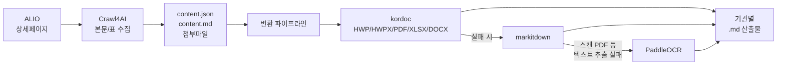

# crawl4alio

**GitHub**: https://github.com/bigone-kcrew/crawl4alio

공공기관 경영정보 공개시스템([ALIO](https://www.alio.go.kr))과 국가법령정보([law.go.kr](https://www.law.go.kr)), 기관 내부규정 게시판을 수집하고, 첨부파일(HWP/PDF/XLSX 등)을 Markdown으로 변환하는 Node.js 도구 모음입니다.

> 이 저장소는 **수집·변환 방법론(코드)만 배포**합니다. 실제로 수집된 데이터(경영공시 첨부파일, 법령 원문, 기관 내규 등)는 포함하지 않습니다. 각자 환경에서 직접 수집해서 사용하세요.

## 무엇을 할 수 있나요

1. **ALIO 경영공시 수집** — 355개 공공기관 × 전체 92개 공시항목(정기/수시 자동 구분). 공시항목(`--scope all|--categories|--items`)과 기관(`--ministry|--apba-ids|--inst-type`)을 자유롭게 선택
2. **증분 동기화** — 저장본과 웹 최신본을 대조해 신규·누락 공시만 수집 (`sync_alio.js`: 반자동 report / 자동 apply, `sync_legal.js`: 법령 개정 감지)
3. **법령·행정규칙 수집** — law.go.kr Open API(DRF)로 본문+**별표·서식(붙임)** 구조화 수집, 검색 기반 법령 추가(`add_legal_source.js`), 그 외 부처 지침은 크롤링+변환
4. **기관 내부규정 수집** — ALIO `21110` 게시판에서 기관별 규정 수집 (최신본 또는 `--all-files`로 개정 이력 전체)
5. **Markdown 변환 파이프라인** — HWP/PDF/XLSX/DOCX 등을 kordoc → markitdown → PaddleOCR(스캔 문서) 순으로 폴백하며 변환. ZIP 자동 해제(`extract_zips.js`), raw/md 미러 출력(`--md-root`) 지원

## 아키텍처



- **kordoc**(https://github.com/chrisryugj/kordoc)은 npm 의존성으로 **내장**되어 서버 없이 동작합니다 (HWP3/5·HWPX·PDF·XLS(X)·DOCX).
- **Crawl4AI**(ALIO 본문 표)와 **PaddleOCR**(스캔 PDF)은 외부 서비스로, 풀스택 프로필의 docker compose에 포함되어 있습니다.

## 설치 프로필

| | 최소 프로필 | 풀스택 프로필 (권장, N100급 미니PC~) |
|---|---|---|
| 요구사항 | Node 18+ | Node 18+ + Docker |
| 설치 | `npm install` | `npm install` + `cd deploy && docker compose up -d` |
| 수집 (ALIO 첨부·법령·내규·통계·동기화) | ✅ | ✅ |
| HWP/PDF/DOCX/XLS(X) → MD 변환 | ✅ (kordoc 내장) | ✅ |
| 스캔 PDF OCR (~45% 분량) | ❌ `ocr_needed` 큐 대기 | ✅ PaddleOCR 컨테이너 |
| ALIO 공시 본문 표 수집 | ❌ 스킵 | ✅ Crawl4AI 컨테이너 |
| 파서 직접 연결 | [docs/PARSERS.md](docs/PARSERS.md)의 `/parse` 계약 | — |

풀스택 프로필은 **단일 머신 기준**이며 권장 최소 사양은 Intel N100급(4코어/8GB RAM) — 최근 보급형 PC·미니PC면 충분합니다. 초기 대량 스캔 PDF OCR만 CPU 모드 특성상 시간이 걸릴 수 있으나(백그라운드 배치로 처리), 이후 증분 운영에는 여유가 있습니다. Docker 설치부터 cron 자동화까지의 전체 절차는 **[docs/INSTALL.md](docs/INSTALL.md)** 를 따라가세요.

> **AI 지원 설치**: 이 저장소를 Claude Code 등 AI 코딩 에이전트에 열면 [CLAUDE.md](CLAUDE.md)의 가이드에 따라 환경 진단부터 설치·검증까지 도와줍니다.

## 빠른 시작

```bash
npm install
cp .env.example .env.api    # law.go.kr API 키 등 입력
source .env.api

node collection/check_services.js   # 환경 진단 — 활성 기능 확인

# (풀스택) 파서 스택 기동
cd deploy && docker compose up -d && cd ..

# 1. ALIO 경영공시 수집 — 항목·기관 선택 가능
node collection/download_documents_advanced.js --print-scope          # 수집 범위 미리보기
node collection/download_documents_advanced.js --categories 노동조합   # 예: 노동조합 관련 항목만
npm run collect:alio                                                  # yaml 설정 기준

# 2. 파일 인덱스 → Markdown 변환 → (스캔 문서) OCR
npm run build:file-index
npm run convert:markdown
npm run convert:ocr

# 3. 이후 일상 운영: 증분 동기화
npm run sync:alio                    # 신규 공시 감지 (리포트)
node collection/sync_alio.js --mode=apply   # 감지 즉시 자동 수집
```

더 자세한 사용법은 [docs/COLLECTION.md](docs/COLLECTION.md), [docs/CONVERSION.md](docs/CONVERSION.md), [docs/PARSERS.md](docs/PARSERS.md)를 참고하세요.

## 폴더 구조

```
crawl4alio/
├── collection/                  # 수집·변환 스크립트
│   ├── download_documents_advanced.js   # ALIO 경영공시 메인 크롤러
│   ├── download_statistics.js           # ALIO 통계 엑셀 다운로드
│   ├── check_disclosure_recency.js      # 신규 공시 모니터링
│   ├── download_susi_documents.js       # 수시공시 수집
│   ├── collect_legal_corpus.js          # 법령·지침 corpus 수집기
│   ├── enrich_legal_ministry.js         # law.go.kr DRF로 소관부처 보강
│   ├── collect_institution_bylaws.js    # 기관 내부규정 게시판 수집
│   ├── convert_to_markdown.js           # kordoc→markitdown 변환 (체크포인트/동시성)
│   ├── convert_ocr_needed.js            # PaddleOCR 변환 (스캔 문서)
│   ├── convert_reference_docs.js        # 범용 참고문서 변환 (법령/내규 공용)
│   ├── build_download_file_index.js     # manifest → 다운로드 파일 인덱스 안전 병합
│   ├── process_statistics.js / convert_statistics_to_md.js / build_statistics_index.js
│   └── project/crawler/
│       ├── config/crawl_targets.yaml    # 수집 대상 공시코드·연도 설정
│       └── utils/                       # 크롤러 공용 유틸(경로, 로깅, 첨부추출 등)
├── ocrtomarkdown/                # PaddleOCR 응답을 .md로 저장하는 독립 CLI
├── data/
│   ├── institutions.json        # ALIO 355개 공공기관 목록 (공개 정보, 시드 데이터)
│   └── disclosure_items.json    # ALIO 공시항목 코드 체계 (공개 정보, 시드 데이터)
├── docs/
├── .env.example
├── package.json
└── LICENSE
```

`data/` 하위의 수집 결과물(`structured_data/`, `legal-md/`, `institution-bylaws*/`, `logs/`)은 `.gitignore` 처리되어 있습니다 — 직접 실행해서 채우세요.

## 기수집 데이터 문의

이 저장소는 코드만 배포하며 실제 수집 결과물은 포함하지 않습니다(위 이유 참고).
2026-07-01 기준으로 수집·변환된 자료가 필요하신 분은 **bigone@k-union.kr** 로 문의해 주세요.
개인정보·기관 내부용 자료는 제외하고 필요 범위에 맞춰 안내드립니다.

## 법적/윤리적 참고사항

- ALIO·law.go.kr 데이터는 공공누리(공공저작물) 또는 공공데이터법에 따라 공개된 정보입니다. 각 사이트의 이용약관과 저작권 표시 규정을 확인하세요.
- law.go.kr Open API는 사전에 [이용자 등록](https://open.law.go.kr)이 필요하며, 발급받은 ID를 본인 명의로만 사용하세요.
- 과도한 동시 요청은 대상 서버에 부담을 줄 수 있습니다. 기본 동시성 설정(`CONCURRENT` 등)과 `random_delay` 설정을 참고해 매너 있게 수집하세요.
- 기관 내부규정 등 제3자 문서를 재배포할 때는 해당 기관의 공개 범위와 저작권을 확인하세요.

## 라이선스

MIT License. [LICENSE](LICENSE) 참고. 연동하는 제3자 오픈소스 도구(kordoc·PaddleOCR·Crawl4AI·MarkItDown)의 라이선스는 [NOTICE.md](NOTICE.md)를 참고하세요.
